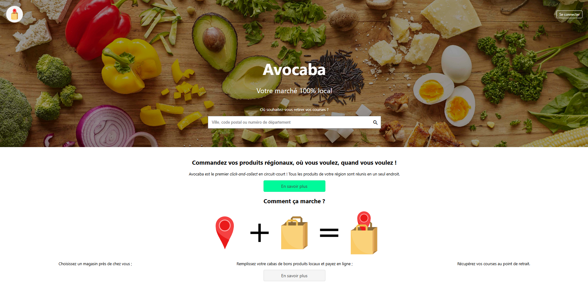

#  Avocaba

*2022 – Projet réalisé par Paul Baratin, Axel Leblanc, Pierre Saussereau, Maxime Rogaume--Esper*

Site de *click-and-collect* en circuit court.

## Contenu du dépôt

Ce dépôt s'organise en plusieurs dossiers :

- Le dossier `vues` contient les différentes pages du site.
- Le dossier `composants` contient des composants *graphiques* réutilisables, tels que l'en-tête ou le pied de page.
- Le dossier `traitements` contient les différents traitements effectués côté serveur, comme la connexion à la base de données, les requêtes vers la base de données, la gestion du panier (appelé "cabas" dans ce projet), etc.
- Le dossier `stylesheets` contient les feuilles de style. Il y en a deux : `layout.css` décrit la mise en page, tandis que `style.css` contient la mise en forme. Ces fichiers CSS s'organisent en plusieurs parties, chacune correspondant à une page ou un ensemble de pages.
- Le dossier `img` contient les différentes images du site.
- Le dossier `js` contient des scripts en JavaScript, pour rendre le site un peu plus interactif.
- Enfin, le dossier `db` contient le MCD et le MLD de la base de données, un script SQL contenant la structure de la base de données et un dump.

## Installation

Ce projet a été développé en [PHP](https://www.php.net/) et fonctionne sur un [serveur web Apache](https://httpd.apache.org/).
Il utilise également [MySQL](https://www.mysql.com/) ou [MariaDB](https://mariadb.com/) comme système de gestion de base de données.

Copier le dossier `avocaba` à la racine *physique* du serveur (par exemple `C:\xampp\htdocs` avec XAMPP sous Windows), sans le dossier `db` et sans les fichiers `*.md`.

L'URL de l'accueil du site est la suivante : `http://localhost/avocaba`.

### Configuration de la base de données

Le dossier `db` contient deux fichiers SQL :

- `avocaba.sql` contient la structure de la base de données.
- `dump.sql` contient la structure de la base et les données qu'elle contient.

1. Créer une base nommée `avocaba` et y importer le dump (il s'agit du seul fichier à importer).
2. Créer un compte utilisateur nommé `Avocaba`, ayant les privilèges suivants : `SELECT, INSERT, UPDATE, DELETE` (il est préférable de restreindre ces privilèges à la base `avocaba`).
3. Dans `traitements/db.inc.php`, définir le mot de passe du compte créé à l'étape précédente comme valeur de la constante `DB_PASSWORD`.

> Le projet a été développé et testé avec les versions suivantes :
>
> - XAMPP : 8.1.5 (Windows)
> - PHP : 8.1.5
> - MariaDB : 10.4.24

## Comptes utilisateurs pour la démo

|  Adresse e-mail   | Mot de passe |
|:-----------------:|:------------:|
| pierre@example.fr |  abcdef1234  |
|  paul@example.fr  |  azerty123   |

*Il est également possible de se créer un compte.*

## Crédits images

* **Image d'arrière-plan :** Photo by [Yu Hosoi](https://unsplash.com/@yu_salad?utm_source=unsplash&utm_medium=referral&utm_content=creditCopyText) on [Unsplash](https://unsplash.com/?utm_source=unsplash&utm_medium=referral&utm_content=creditCopyText)
* **Icônes** issues de [Flaticon](https://flaticon.com)
* **Logo du site :** Axel Leblanc

-----

***Note :** Les pages "à propos" n'ont pas été développées. Les liens présents dans le pied-de-page et la page d'accueil ne fonctionnent donc pas.*